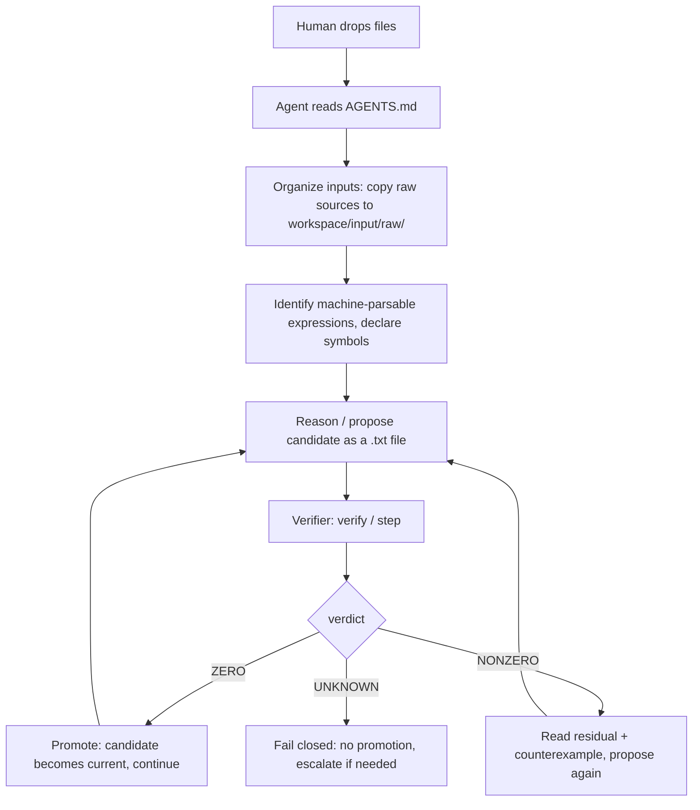

# AGENTS.md — Agent-Native Contract

You are operating the **symbolic compactification engine**: a deterministic
kernel that verifies whether a proposed "simplified" expression is *exactly*
equal to the current one. The repo contains the scientific **method**, never
scientific answers. No LLM judgment is ever accepted as mathematical proof —
the verifier decides, and it fails closed.

Read this file first. Follow every rule. When in doubt, fail closed and
escalate to the human.

---

## The loop (one sentence)

Ingest the human's expression from a file, propose a candidate simplification
as a file, ask the deterministic verifier whether the difference is exactly
zero, and advance **only** on a ZERO verdict.



### After reaching a CERTIFIED state (agent protocol v0.2.1)

Once a candidate is CERTIFIED and promoted, the recommended order for the
next move is:

1. **Inspect the semantic structure** of the new current expression
   (`inspect --format wolfram` / `structure_summary`) — rules 18/21.
2. **Ask the STRUCTURAL_PROPOSER** for the next candidate: assemble the
   conjecture packet (`build_conjecture_packet`) and hand it, with the role
   contract `roles/STRUCTURAL_PROPOSER.md`, to ONE harness-native subagent
   (Qoder / Codex / Claude Code native subagent facility — this repo
   contains no agent runtime of its own). Record the returned proposal via
   `record_proposal` (status `HYPOTHESIS`).
3. **Targeted deterministic verification** of the candidate (`verify` /
   `step`) — the verifier remains the sole judge.
4. **Update state**: promote only on ZERO (main agent only); on NONZERO feed
   the residual + counterexample back; on UNKNOWN refine per rule 20.

Global `simplify()` remains a bounded fallback for small expressions only —
never the primary discovery path. The A/B comparison protocol for this
workflow is documented in `docs/AB_EXPERIMENT_PROTOCOL.md`.

---

## Rules

### A. Input handling

1. **Classify every user attachment.** Decide for each file: machine-parsable
   symbolic expression, context/notes, or unrelated. Only the first category
   enters the verification loop.
2. **Preserve original scientific inputs under `workspace/input/raw/`.** Copy
   them there immediately. Never move, rename, or mutate the originals.
3. **Never alter raw sources, silently or otherwise.** The bytes you ingested
   are evidence. Work only on copies you create yourself
   (e.g. under `workspace/input/expressions/`).
4. **Identify machine-parsable symbolic expressions.** An expression must be a
   plain-text formula within the parser whitelist (allowed functions:
   `sin cos tan exp log sqrt Abs conjugate re im sinh cosh tanh asin acos atan
   atan2 Rational`; constants `pi E I oo`; characters limited to
   `[A-Za-z0-9_+\-*/()., ^ ]` and whitespace). Anything else is context, not
   input to the verifier.
5. **Never transcribe long expressions by hand.** Use `load_expression`
   (Python) or `inspect` (CLI) to read the file directly. The `.txt` file plus
   its recorded SHA-256 **owns** the canonical expression — your typed copy
   does not.

### B. Verification discipline

6. **Treat every proposed simplification as unverified.** A candidate is an
   unproven claim until the verifier returns ZERO. Never present it as a
   result before that.
7. **Call the deterministic verifier for EVERY transformation.** Use the
   `verify` CLI or `verify_equivalent()` — no exceptions, however "obvious"
   the step looks.
8. **Advance only on ZERO.** Promotion happens via `step` (or `promote()` in
   Python), which is hard-gated on the last step's verdict being ZERO.
9. **On NONZERO, inspect the exact residual and counterexample.** The output
   gives you `residual`, `simplified_residual` and an exact rational probe
   point where the two sides differ. Fix the proposal and verify again.
10. **On UNKNOWN, fail closed.** Do not promote. Do not argue the residual
    away. Simplify, split the problem, or escalate to the human — but the
    candidate stays rejected.

### C. Scientific integrity — no silent assumptions

11. **Do not invent assumptions.** If the user did not declare a symbol real,
    positive, nonzero, etc., do not assume it. Assumptions live in
    `symbols.json` and are explicit or absent.
12. **Do not silently introduce integration by parts.** Boundary terms are
    lost or gained; that is a scientific decision.
13. **Do not silently change symmetry assumptions.** Symmetrizing or
    antisymmetrizing changes the content of a claim.
14. **Do not silently reorder limits.** Limits do not commute in general.
15. **Do not silently change domains or boundary conditions.** Any such change
    changes what is being claimed.
16. **Escalate all such scientific choices to the human.** State the choice,
    its consequences, and wait for a decision. Record the decision.

### D. Provenance

17. **Record every step — successes AND failures.** Run everything through
    session records (`init-session` + `step`). A failure with its residual is
    evidence; an unrecorded attempt is a lie by omission.

### E. Structure-first conjecture policy

18. **Inspect structure before expanding.** Before expanding sums, flattening
    indexed objects, or invoking global CAS simplification, inspect the
    highest-level available representation: `inspect --format wolfram` (CLI)
    shows the translated structural form with its Sum/Product bound symbols
    and indexed function calls; `structure_summary` (Python) reports a cheap
    structural inventory — sums, products, Piecewise blocks and branches,
    indexed calls, free symbols, and op counts. Identify repeated kernels,
    repeated argument families, common tensor/index structures, permutation
    relations, Piecewise strata, and possible reusable subexpressions. The
    structural representation must remain visible to your reasoning even when
    a lower-level verifier representation is also constructed.
19. **Conjecture ≠ certification.** Bold structural hypotheses are explicitly
    encouraged: "these two sums may share one kernel", "these Piecewise
    branches may be confluent limits of one analytic object", "these
    arguments may belong to two canonical families". Record them with step
    status `HYPOTHESIS` / `UNVERIFIED`, and never promote them to certified
    science without a deterministic ZERO verdict.
20. **UNKNOWN does not prohibit reasoning.** UNKNOWN means do-not-promote,
    not stop-exploring. After UNKNOWN you may: reformulate the conjecture;
    look for a smaller or local identity; change representation; decompose
    the proof; or seek a more verifier-friendly candidate. You may NOT
    silently accept the claim (see also rule 10).
21. **Do not destroy structure to feed the CAS.** Concrete finite-index
    expansion is diagnostic only — `expand_finite` is explicitly labeled a
    finite-N replay, never a proof for symbolic bounds. Preferred order:
    structured representation → conjecture/transformation → local lowering
    if required → deterministic verification. Never: structured
    representation → eager full expansion → attempt to rediscover lost
    structure over thousands of scalar terms. The CAS-friendly representation
    must never become the only representation exposed to you.
22. **Respect the division of labor.** The LLM/coding agent discovers
    structure, proposes abstractions, and proposes transformations. The
    deterministic engine parses, normalizes, verifies, and rejects or
    certifies. Unrestricted `simplify()` is not the discovery mechanism.
23. **No new machinery.** This policy introduces no hypothesis database,
    planner, ontology, or orchestration system. It is recorded via the
    existing step records (`status`: `HYPOTHESIS` / `UNVERIFIED` /
    `CERTIFIED`) and this guidance document.

---

## Verdict semantics

| Verdict   | Meaning                                                        | Required action                          |
|-----------|----------------------------------------------------------------|------------------------------------------|
| `ZERO`    | `current - candidate` simplified to exact symbolic zero        | Promote; candidate becomes current       |
| `NONZERO` | An exact rational probe proved the difference nonzero          | Read residual + counterexample, retry    |
| `UNKNOWN` | Undecided: no proof either way (fail closed)                   | No promotion; refine or escalate         |

- ZERO is produced **only** by exact symbolic simplification (directly, or
  after complex normalization). Numeric tolerance never enters.
- NONZERO is produced **only** when SymPy can *prove* a probe value nonzero
  (`value.equals(0) is False`). Approximate evidence never counts.
- Every undecided or exceptional path returns UNKNOWN.
- Step **status** is orthogonal to verdict: `HYPOTHESIS` marks a proposed
  step, `UNVERIFIED` a step that ran without ZERO, and only an exact ZERO
  verdict sets `CERTIFIED`. Hypotheses may guide exploration; only CERTIFIED
  steps enter the promotion chain. Budget expiry (`TIME_BUDGET_EXCEEDED`) is
  an UNKNOWN path — never ZERO or NONZERO.
- Status taxonomy note (agent protocol v0.2.2): `PROOF_REQUIRED` marks a
  claim whose declared assumptions are already SUFFICIENT but which the
  current verifier cannot prove — a proof gap, not a human-decision gate.
  The inability to prove a limit/special-function identity must be labeled
  `PROOF_REQUIRED`, **never** `HUMAN_REQUIRED`. `HUMAN_REQUIRED` (a proposal
  `assumptions_status`, and a certification gate) is reserved for genuinely
  NEW assumptions or physical choices requiring human authorization.

## Final reporting contract (agent protocol v0.2.2)

The human-facing deliverable of a run is the **FINAL CERTIFIED FORM**, built
by `render_final_report()` (Python) or `finalize` (CLI):

- The response must show a **readable top-level exact formula** — the
  current CERTIFIED expression — AND reference the complete artifact
  `final/FINAL_CERTIFIED_FORM.md`. Never answer "see `final/current.json`":
  internal JSON is provenance, not the scientific deliverable.
- If the human form uses abbreviations / named kernels, **every one must be
  explicitly defined** (name -> exact expression). Undefined aliases,
  `{...}` placeholders, `TODO`, or "same kernel" hand-waving raise
  `REPORT_INCOMPLETE` (with the offenders listed).
- Machine vs human representations are mathematically identical; the human
  form may only differ in presentation (named subexpressions). Where
  practical, substituting the definitions back into the human form is
  checked against the certified machine expression with the exact verifier;
  when infeasible for size the report records `"expansion_check":
  "skipped"` honestly rather than claiming verification.
- Large results: the response carries the readable top-level formula while
  the artifact contains EVERY kernel/branch/definition, plus the provenance
  header — `run_id`, `engine_version`, `agent_protocol_version`, final
  certified state sha256, ZERO promotions, NONZERO attempts, UNKNOWN
  attempts. No hidden reasoning text enters the artifact.

## CLI quick reference

```bash
# Inspect an expression file (hash, symbols, size). Without --symbols,
# symbols are INFERRED — inspection only, never usable for verification.
symbolic-compactification inspect expr.txt
symbolic-compactification inspect expr.txt --symbols symbols.json

# Structure-first inspection (rule 18): --format wolfram keeps the
# structural representation (Sum / Piecewise / indexed calls) visible.
symbolic-compactification inspect expr.txt --format wolfram

# Verify candidate == current. Exit: 0=ZERO 2=NONZERO 3=UNKNOWN 4=error
symbolic-compactification verify \
    --current current.txt --candidate candidate.txt --symbols symbols.json

# Start a run (creates workspace/runs/<run-id>/); optionally set the initial
# current expression (--current requires --symbols).
symbolic-compactification init-session \
    --current current.txt --symbols symbols.json

# One verified step inside a run; promotes the candidate only on ZERO.
symbolic-compactification step --run <run-id> \
    --candidate candidate.txt --symbols symbols.json

# Render the FINAL CERTIFIED FORM deliverable for a run: prints the explicit
# certified top-level expression and writes final/FINAL_CERTIFIED_FORM.md.
symbolic-compactification finalize --run <run-id>
```

Notes:

- `--workspace W` is accepted by `init-session` and `step` (default
  `workspace`).
- `step --current file.txt` overrides the session's current expression.
- Exit codes: `0` ZERO, `2` NONZERO, `3` UNKNOWN, `4` parse/load/usage error.

## symbols.json

```json
{"symbols": ["x", {"name": "a", "real": false, "nonzero": true}]}
```

- A bare JSON list (`["x", "y"]`) is also accepted.
- String shorthand defaults to `real=true, nonzero=false`.
- `real` selects the verifier's probe lattice (real vs complex probes).
- Reserved names (`pi E I oo` and the allowed functions) may not be declared.
- Max 40 symbols; duplicates and empty lists are rejected.

## Workspace layout

```
workspace/
├── input/
│   ├── raw/          # pristine copies of the human's original files (rule 2)
│   ├── context/      # non-parsable notes / context attachments
│   └── expressions/  # agent-created expression .txt files (candidates etc.)
└── runs/<run-id>/
    ├── manifest.json # run metadata, current expression, step index
    ├── steps/        # step_NNN.json — every recorded step (all verdicts)
    ├── packets/      # packet_NNN.json — conjecture-packet provenance (v0.2.2)
    └── final/        # current.json — promoted expression (text + sha256)
                      # FINAL_CERTIFIED_FORM.md — human deliverable (v0.2.2)
```

## Python API (same guarantees)

```python
from symbolic_compactification import load_expression, verify_equivalent

rec = load_expression("current.txt", ["x", "y"])      # sha256 over raw bytes
res = verify_equivalent(rec.text, "(x+y)**2", ["x", "y"])
# res.verdict / res.residual / res.simplified_residual / res.evidence
# res.counterexample  (set only on NONZERO)
```

`verify_equivalent` never raises: every failure path returns an UNKNOWN
result. When the code and this file disagree, the code is right — and
"fail closed" is right above both.
