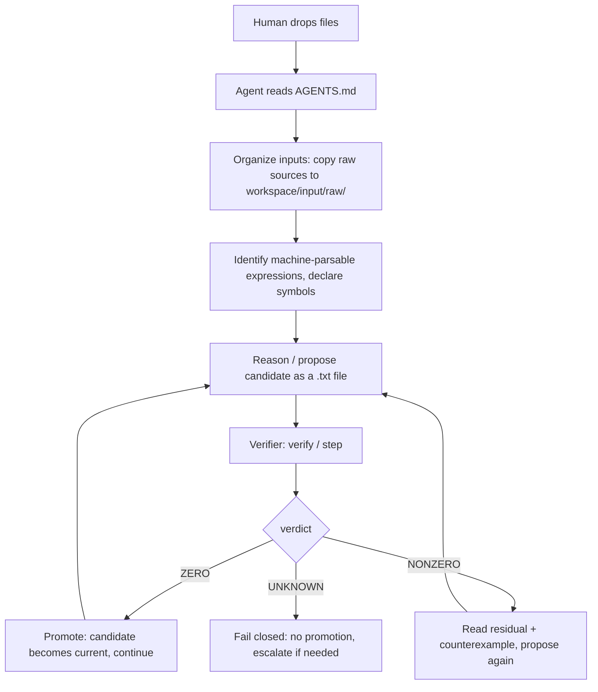

# AGENTS.md — Agent-Native Contract

You are operating the **symbolic compactification engine**: a deterministic
kernel that verifies whether a proposed "simplified" expression is *exactly*
equal to the current one. The repo contains the scientific **method**, never
scientific answers. No LLM judgment is ever accepted as mathematical proof —
the verifier decides, and it fails closed.

Read this file first. Follow every rule. When in doubt, fail closed and
escalate to the human.

---

## The loop (one sentence)

Ingest the human's expression from a file, propose a candidate simplification
as a file, ask the deterministic verifier whether the difference is exactly
zero, and advance **only** on a ZERO verdict.



---

## Rules

### A. Input handling

1. **Classify every user attachment.** Decide for each file: machine-parsable
   symbolic expression, context/notes, or unrelated. Only the first category
   enters the verification loop.
2. **Preserve original scientific inputs under `workspace/input/raw/`.** Copy
   them there immediately. Never move, rename, or mutate the originals.
3. **Never alter raw sources, silently or otherwise.** The bytes you ingested
   are evidence. Work only on copies you create yourself
   (e.g. under `workspace/input/expressions/`).
4. **Identify machine-parsable symbolic expressions.** An expression must be a
   plain-text formula within the parser whitelist (allowed functions:
   `sin cos tan exp log sqrt Abs conjugate re im sinh cosh tanh asin acos atan
   atan2 Rational`; constants `pi E I oo`; characters limited to
   `[A-Za-z0-9_+\-*/()., ^ ]` and whitespace). Anything else is context, not
   input to the verifier.
5. **Never transcribe long expressions by hand.** Use `load_expression`
   (Python) or `inspect` (CLI) to read the file directly. The `.txt` file plus
   its recorded SHA-256 **owns** the canonical expression — your typed copy
   does not.

### B. Verification discipline

6. **Treat every proposed simplification as unverified.** A candidate is an
   unproven claim until the verifier returns ZERO. Never present it as a
   result before that.
7. **Call the deterministic verifier for EVERY transformation.** Use the
   `verify` CLI or `verify_equivalent()` — no exceptions, however "obvious"
   the step looks.
8. **Advance only on ZERO.** Promotion happens via `step` (or `promote()` in
   Python), which is hard-gated on the last step's verdict being ZERO.
9. **On NONZERO, inspect the exact residual and counterexample.** The output
   gives you `residual`, `simplified_residual` and an exact rational probe
   point where the two sides differ. Fix the proposal and verify again.
10. **On UNKNOWN, fail closed.** Do not promote. Do not argue the residual
    away. Simplify, split the problem, or escalate to the human — but the
    candidate stays rejected.

### C. Scientific integrity — no silent assumptions

11. **Do not invent assumptions.** If the user did not declare a symbol real,
    positive, nonzero, etc., do not assume it. Assumptions live in
    `symbols.json` and are explicit or absent.
12. **Do not silently introduce integration by parts.** Boundary terms are
    lost or gained; that is a scientific decision.
13. **Do not silently change symmetry assumptions.** Symmetrizing or
    antisymmetrizing changes the content of a claim.
14. **Do not silently reorder limits.** Limits do not commute in general.
15. **Do not silently change domains or boundary conditions.** Any such change
    changes what is being claimed.
16. **Escalate all such scientific choices to the human.** State the choice,
    its consequences, and wait for a decision. Record the decision.

### D. Provenance

17. **Record every step — successes AND failures.** Run everything through
    session records (`init-session` + `step`). A failure with its residual is
    evidence; an unrecorded attempt is a lie by omission.

---

## Verdict semantics

| Verdict   | Meaning                                                        | Required action                          |
|-----------|----------------------------------------------------------------|------------------------------------------|
| `ZERO`    | `current - candidate` simplified to exact symbolic zero        | Promote; candidate becomes current       |
| `NONZERO` | An exact rational probe proved the difference nonzero          | Read residual + counterexample, retry    |
| `UNKNOWN` | Undecided: no proof either way (fail closed)                   | No promotion; refine or escalate         |

- ZERO is produced **only** by exact symbolic simplification (directly, or
  after complex normalization). Numeric tolerance never enters.
- NONZERO is produced **only** when SymPy can *prove* a probe value nonzero
  (`value.equals(0) is False`). Approximate evidence never counts.
- Every undecided or exceptional path returns UNKNOWN.

## CLI quick reference

```bash
# Inspect an expression file (hash, symbols, size). Without --symbols,
# symbols are INFERRED — inspection only, never usable for verification.
symbolic-compactification inspect expr.txt
symbolic-compactification inspect expr.txt --symbols symbols.json

# Verify candidate == current. Exit: 0=ZERO 2=NONZERO 3=UNKNOWN 4=error
symbolic-compactification verify \
    --current current.txt --candidate candidate.txt --symbols symbols.json

# Start a run (creates workspace/runs/<run-id>/); optionally set the initial
# current expression (--current requires --symbols).
symbolic-compactification init-session \
    --current current.txt --symbols symbols.json

# One verified step inside a run; promotes the candidate only on ZERO.
symbolic-compactification step --run <run-id> \
    --candidate candidate.txt --symbols symbols.json
```

Notes:

- `--workspace W` is accepted by `init-session` and `step` (default
  `workspace`).
- `step --current file.txt` overrides the session's current expression.
- Exit codes: `0` ZERO, `2` NONZERO, `3` UNKNOWN, `4` parse/load/usage error.

## symbols.json

```json
{"symbols": ["x", {"name": "a", "real": false, "nonzero": true}]}
```

- A bare JSON list (`["x", "y"]`) is also accepted.
- String shorthand defaults to `real=true, nonzero=false`.
- `real` selects the verifier's probe lattice (real vs complex probes).
- Reserved names (`pi E I oo` and the allowed functions) may not be declared.
- Max 40 symbols; duplicates and empty lists are rejected.

## Workspace layout

```
workspace/
├── input/
│   ├── raw/          # pristine copies of the human's original files (rule 2)
│   ├── context/      # non-parsable notes / context attachments
│   └── expressions/  # agent-created expression .txt files (candidates etc.)
└── runs/<run-id>/
    ├── manifest.json # run metadata, current expression, step index
    ├── steps/        # step_NNN.json — every recorded step (all verdicts)
    └── final/        # current.json — promoted expression (text + sha256)
```

## Python API (same guarantees)

```python
from symbolic_compactification import load_expression, verify_equivalent

rec = load_expression("current.txt", ["x", "y"])      # sha256 over raw bytes
res = verify_equivalent(rec.text, "(x+y)**2", ["x", "y"])
# res.verdict / res.residual / res.simplified_residual / res.evidence
# res.counterexample  (set only on NONZERO)
```

`verify_equivalent` never raises: every failure path returns an UNKNOWN
result. When the code and this file disagree, the code is right — and
"fail closed" is right above both.
