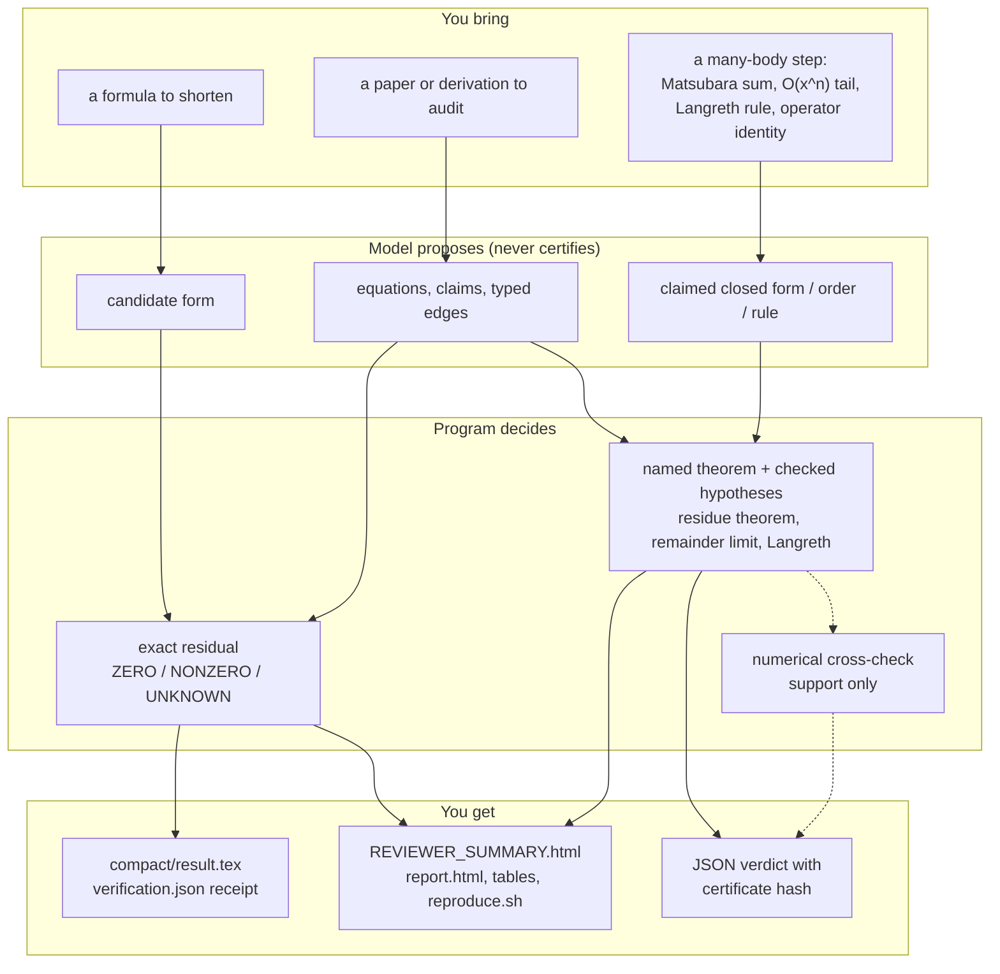
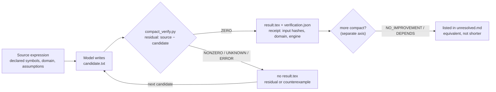

# symbolic-compactification

**Verified symbolic reasoning for theoretical physics.**

An installable skill with three tasks over one engine:
- **Compactify** a given expression. The agent proposes a candidate, the
  program checks the residual, and improvement is scored separately.
- **Paper audit** (derivation audit). It inventories numbered equations,
  reconstructs claims and load-bearing edges, and emits reviewer **HTML**
  and **Markdown**.
- **Many-body checks.** These cover Matsubara sums, asymptotic remainders,
  Langreth rules, operator identities and Green's-function integrals.

A model may propose. Only exact `ZERO` is machine Exact, and the model
cannot write that status.

This is not a CAS, not a theorem prover, and not an autonomous physicist.
Core verification needs **no API key**.

Package `0.3.2-alpha` (PEP 440: `0.3.2a0`). Engine `0.3.0`.
Skill metadata `skill_version` `0.3.5` (portable workflow), compatible
with engine `>=0.3.2a0,<0.4`. Research preview.

## What it does



The statuses a reviewer sees:
- green is an exact local `ZERO`;
- blue is a definition, a cited rule, or `CERTIFIED_BY_RULE`, which means
  an exact computation plus a named theorem;
- orange needs a reviewer, e.g. unknown, assumption required, or numerical
  support only;
- red is `NONZERO`.

## 1. Install the skill

From any machine with [GitHub CLI](https://cli.github.com/) `gh skill`:

**Codex**

```bash
gh skill install DarrenWongKaWa/symbolic-compactification symbolic-compactification --agent codex --scope user
```

**Claude Code**

```bash
gh skill install DarrenWongKaWa/symbolic-compactification symbolic-compactification --agent claude-code --scope user
```

Restart the harness so it reloads skills.

## 2. Start Codex or Claude Code

Open a **new, unrelated directory**. Do not open this development repository.

## 3. Ask only

```text
Compactify this formula. Keep the declared symbols and domain.
Do not introduce a new name for the whole expression.
```

The installed skill proposes a candidate, runs `compact_verify.py`, and
writes a bound receipt. Machine Exact is issued only by `certify.py` /
`compact_verify.py`.

## 4. Open the result

```text
compact/result.tex
compact/report.md
compact/verification.json
compact/unresolved.md
```

Paper audit is a secondary path. It starts only when the user asks to
audit a derivation, not because an arXiv link appears in a translation.

Reviewer packages include a pre-generated `REVIEWER_SUMMARY.html` and matching
Markdown view. Open the HTML first when a reviewer wants to inspect the
evidence without installing or running the verifier; use `reproduce.sh` for an
independent replay. The summary is generated from sealed machine records and
does not promote or hide any status.

## Tutorial

**A. Compactify a formula.** Install the skill (step 1) and open an empty
directory in Codex or Claude Code. Paste the formula with its symbols, then
ask as in step 3. The agent writes `candidate.txt` and runs
`compact_verify.py`. Read `compact/report.md`: `result.tex` exists only
when the relation is `ZERO`.

**B. Audit a derivation.** Start a workspace, describe the steps as typed
edges, and let the engine judge them:

```bash
symbolic-compactification audit init my-audit          # skeleton workspace
# put the source in manuscript/, list the steps in edges/edges.yaml
symbolic-compactification audit verify my-audit        # seal machine records
symbolic-compactification audit report my-audit        # report.html + REVIEWER_SUMMARY.html
symbolic-compactification audit package my-audit       # shareable folder with reproduce.sh
```

`audit verify` exits with 2 when some edge is `NONZERO`, which is a result
rather than an error. In the package, `./reproduce.sh` replays the audit
offline and fails if any replayed edge differs from the shipped records.
Open `reports/REVIEWER_SUMMARY.html` first. It shows the counts, the
review queue with each claim, and the provenance. `report.html` has every
edge with a filter. To see a complete example with many-body edges, copy
`tests/fixtures/audit_demos/M` and run the same commands on the copy.

**C. Check a many-body step directly.** Each command prints one JSON
verdict:

```bash
symbolic-compactification manybody matsubara --statistics fermion \
  --summand "1/((z-a)*(z-c))" --claim "(nF(a)-nF(c))/(a-c)" \
  --symbols '[{"name":"a"},{"name":"c"},{"name":"beta","nonzero":true}]'
# -> "status": "CERTIFIED_BY_RULE", numeric cross-check "AGREES"

symbolic-compactification manybody langreth --product A,B --component less \
  --claim "A_R*B_less + A_less*B_A"
# -> "status": "CERTIFIED_BY_RULE"; writing B_R for B_A gives NONZERO
```

**D. Check a whole paper, straight from LaTeX.**

```bash
symbolic-compactification manybody review paper.tex --out review/
```

This one command drafts the cards, checks each step against its verbatim
quote, and writes the reviewer package. Open
`review/reviewer-verification-package/REVIEWER_SUMMARY.html`. You can
also run the stages by hand:

```bash
symbolic-compactification manybody draft paper.tex --out cards/
# edit cards/conventions.yaml: symbols, notation, definitions
symbolic-compactification manybody steps cards/ --require-source --html cards/report.html
```

Every expression in a card is a verbatim quote of the paper. The tool
checks that each quote occurs in the document and translates it itself.
A card that does not match its source is never decided, and a shared
convention cannot be silently redefined by one step.

**E. Review a many-body paper.** List the cards as `STEP_CARD` edges in an
audit workspace and package it (see
[`docs/paper-audit.md`](docs/paper-audit.md)). The reviewer page shows,
for every step:
- the formula rendered from the paper's own LaTeX;
- its source: title, line, equation number and `\label`;
- how the tool read it and what the tool computed;
- a counterexample when the step fails.

The page also lists the conventions to check once, and it flags formulas
that are broken as printed.

[`docs/case-study-jwm.md`](docs/case-study-jwm.md) reviews Jauho,
Wingreen and Meir, PRB 50, 5528 (1994). The review certifies its digamma
relation, finds an unbalanced bracket in its step-response formula, and
catches planted sign errors.

What each check assumes, and what it refuses, is in
[`docs/many-body-equivalence.md`](docs/many-body-equivalence.md). To encode
a paper's derivation one step at a time, write step cards: see
[`docs/encoding-cookbook.md`](docs/encoding-cookbook.md) and
`examples/cards/`.

## What green / blue / orange / red mean

| Colour | Meaning |
|---|---|
| Dark green | Local residual is exact `ZERO` |
| Hatched green | `ZERO` after an explicit substitution (`EXACT_IF_ASSUMPTIONS`) |
| Blue | Definition / cited rule |
| Orange | Reviewer looks (gap, assumption, remainder, numerics) |
| Dark red | Compiled residual is `NONZERO` |

Green is a local residual, not a paper pass. Human Accept does not stamp Exact.

## Optional case library (not loaded by the skill)

`examples/` holds historical paper audits and synthetic toys. They are
**not** default knowledge. A new task must not copy their claims,
equation numbers, or conclusions.

- Synthetic compactification: `examples/forward/`
- Synthetic audit workspace: `examples/audit/minimal/`

Status semantics: [`skills/symbolic-compactification/references/STATUSES.md`](skills/symbolic-compactification/references/STATUSES.md).

## Forward derivation (engine CLI)

Candidate must be exact `ZERO`. Promote only on `ZERO`. `NONZERO` /
`UNKNOWN` never promote.

```bash
python3.12 -m venv .venv
.venv/bin/python -m pip install -e ".[dev]"
.venv/bin/symbolic-compactification --version
```

Reconstruction scripts ship inside the skill folder (Python 3.10 stdlib).
Machine Exact still requires this engine install; without it, algebra stays a gap.

## How the propose-and-verify loop works

The model and the program have separate jobs. The model only writes
candidates. The program alone issues the verdict, and it writes the receipt
that binds that verdict to its inputs.



- **Two axes.** *Relation* (`ZERO` / `NONZERO` / `UNKNOWN` / `ERROR`) is
  whether the candidate equals the source on the declared domain.
  *Improvement* is whether it is actually more compact. A new name that only
  wraps the original can be `ZERO` and still `NO_IMPROVEMENT`.
- **Fail closed.** `result.tex` is written only on `ZERO`. A failed rerun
  deletes the stale one. Changing the formula, domain or kind invalidates an
  old receipt.
- **What `ZERO` covers.** `ZERO` is a statement about one local identity. It
  does not certify the paper the identity came from.

## Why this exists

The workflow began as a manual relay during a theoretical-physics derivation.
A chat model proposed equivalent forms of an expression. Each candidate was
pasted into a coding agent, which ran a symbolic residual check. The residual
or counterexample was then pasted back. The loop found useful forms, but every
step was copy and paste, nothing tied a verdict to the exact input, and it was
easy to lose track of which candidate had actually been checked.

This repository replaces that relay. The agent writes candidates to files,
the verifier reads the same files, and the receipt records hashes of what was
checked. The idea behind the design is that a model may propose but only the
program may certify.

**Related work.** Pairing a generative model with an automatic checker is an
established pattern:
- FunSearch pairs an LLM with a program evaluator (Romera-Paredes *et al.*,
  Nature **625**, 468 (2024)).
- AlphaGeometry pairs a language model with a symbolic deduction engine
  (Trinh *et al.*, Nature **625**, 476 (2024)).
- LLM-guided theorem proving works inside proof assistants such as Lean.

This project claims no new search algorithm. Its contribution is engineering
for everyday physics derivations:
- declared symbols, domains and assumptions;
- a two-axis verdict (equivalence vs. compactness);
- receipts bound to input hashes;
- reviewer-facing HTML and Markdown in which a model cannot write the `Exact`
  status.

## How to cite

Cite the version you used. [`CITATION.cff`](CITATION.cff) holds the metadata,
and GitHub shows it under *Cite this repository*. In a paper's methods or
AI-use statement, name the language model that drove the agent as well as
this tool. The tool does not record which model proposed a candidate.

## Canonical skill

[`skills/symbolic-compactification/SKILL.md`](skills/symbolic-compactification/SKILL.md)

`AGENTS.md` / `CLAUDE.md` only tell the harness where the skill is.
