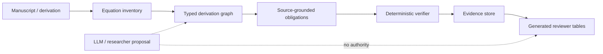

# Figure 1 — System architecture

**Caption (draft).** Derivation Audit pipeline. A manuscript is inventoried
into labelled equations and recorded as a typed derivation graph. Only
supported edges lower to source-grounded executable obligations. A
deterministic verifier returns `ZERO`, `NONZERO`, or `UNKNOWN`. Integrity-bound
records populate an evidence store from which reviewer tables are
*generated*. An LLM or researcher may propose edges, residuals, or
explanatory text; that proposal path has **no certification authority**.

Highlight in the rendered figure:

- solid arrows: machine authority path
- dashed arrows: proposal path
- a red “no write” mark from LLM to `TABLE_VERIFIED`
